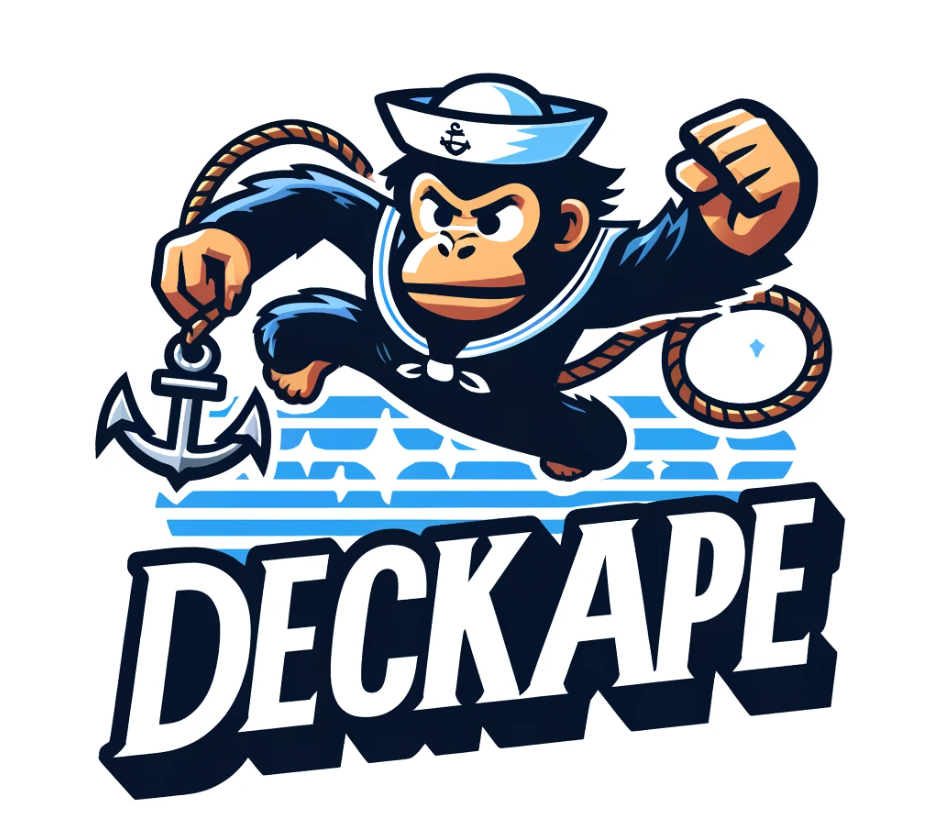

# DeckApe




**DeckApe** is a CLI tool for managing the local container development lifecycle workflows for locally developing containerized serverless functions.


## Features

- Build container
- Build an image
- Delete any local images first
- Stop any containers using the image
- Delete any containers using the image
- Manage container dependencies

## Installation

### Prerequisites

- [Node.js](https://nodejs.org/) (version 14 or higher)
- [npm](https://www.npmjs.com/)

### Steps

1. Clone the repository:
    ```bash
    git clone https://github.com/your-username/deckape.git
    ```

2. Navigate to the project directory:
    ```bash
    cd deckape
    ```

3. Install dependencies:
    ```bash
    npm install
    ```

4. Make the script executable:
    ```bash
    chmod +x deckape.js
    ```

5. Install the CLI tool globally:
    ```bash
    npm install -g .
    ```

## Usage

DeckApe provides several commands to manage your container lifecycle. Below are the available commands:

### Delete Containers and Images

Delete containers and images based on the container name and tag.

```bash
deckape delete <containerName> <containerTag>
```

### Rebuild and Start the Container

Rebuild the Docker container and start it.

```bash
deckape rebuild <containerName> <containerTag>
```

### Publish the Container to AWS ECR

Publish the Docker container to AWS Elastic Container Registry (ECR).

```bash
deckape publish <containerName> <containerTag>
```

## Examples

### Delete Containers and Images

```bash
deckape delete my-container latest
```

### Rebuild and Start the Container

```bash
deckape rebuild my-container latest
```

### Publish the Container to AWS ECR

```bash
deckape publish my-container latest
```

## Contributing

We welcome contributions! Please read our [contributing guidelines](CONTRIBUTING.md) for more details.

## License

This project is licensed under the MIT License. See the [LICENSE](LICENSE) file for details.

## Support

If you have any questions or need help, feel free to open an issue on the [GitHub repository](https://github.com/your-username/deckape/issues).

## Author

[Rex Whitten](https://github.com/rexwhitten)
